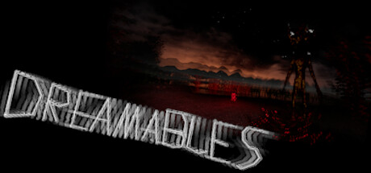
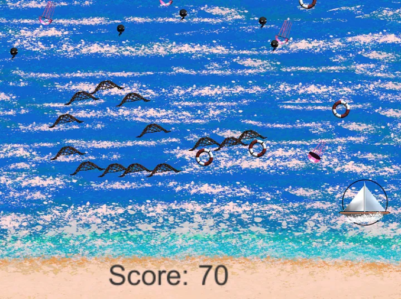
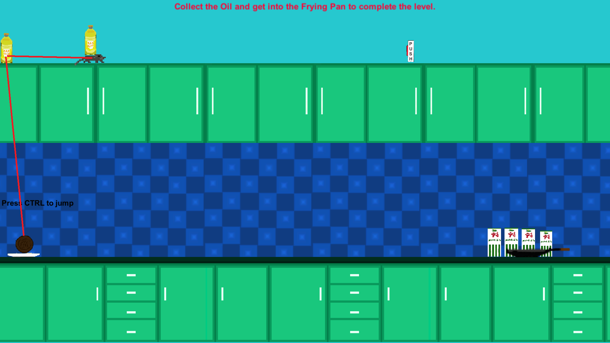

## Dreamables WIP
First person horror game developed in Unreal Engine
- 
- Tags: Category 1
- Badges:
  - Unreal Engine BP [green]
  - Blender [orange]
  - Speedtree [yellow]
- Buttons:
  - Steam Link [https://store.steampowered.com/app/2135930/Dreamables/]
  

## Game Design Project 1 - 2019
2D space invaders alike scrolling type of game where you control a sailing boat shooting lifebuoys to people in the water while avoiding and trapping spawning jellyfishes with your fishing net.
- 
- Tags: Category 2
- Badges:
  - Unity [blue]
  - C# [red]
  - Gimp [green]
- Buttons:
  

## Game Design Project 2 - 2019
2D kitchen game where you control a meatball trying to get to the frying pan to complete the level. To complete this particular level, you had to jump on the plate up over the shelf and land on the moving rat that holds an oil and sit tight until reaching the button that removes the milk who's blocking the way to the frying pan
- 
- Tags: Category 3
- Badges:
  - Unity [blue]
  - C# [red]
  - Gimp [green]
- Buttons:
 